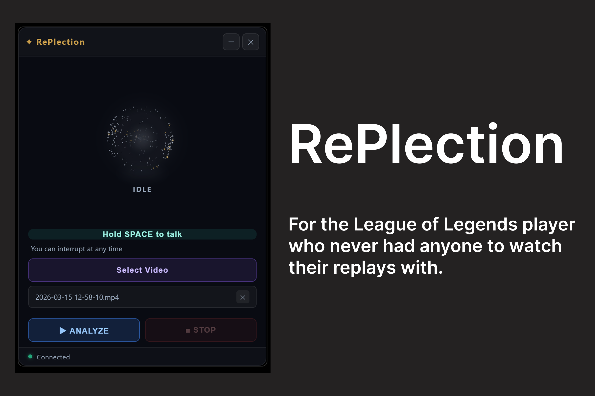
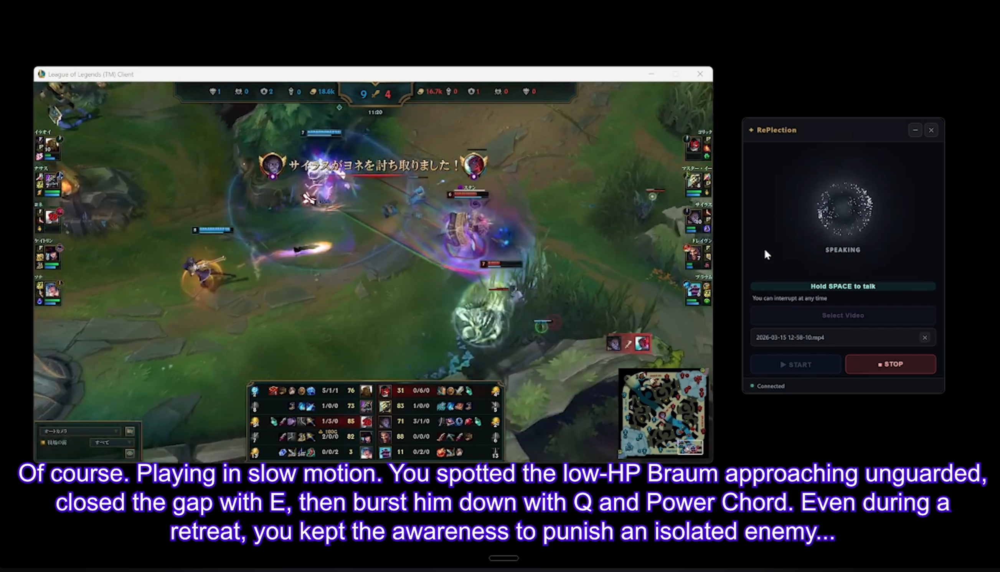
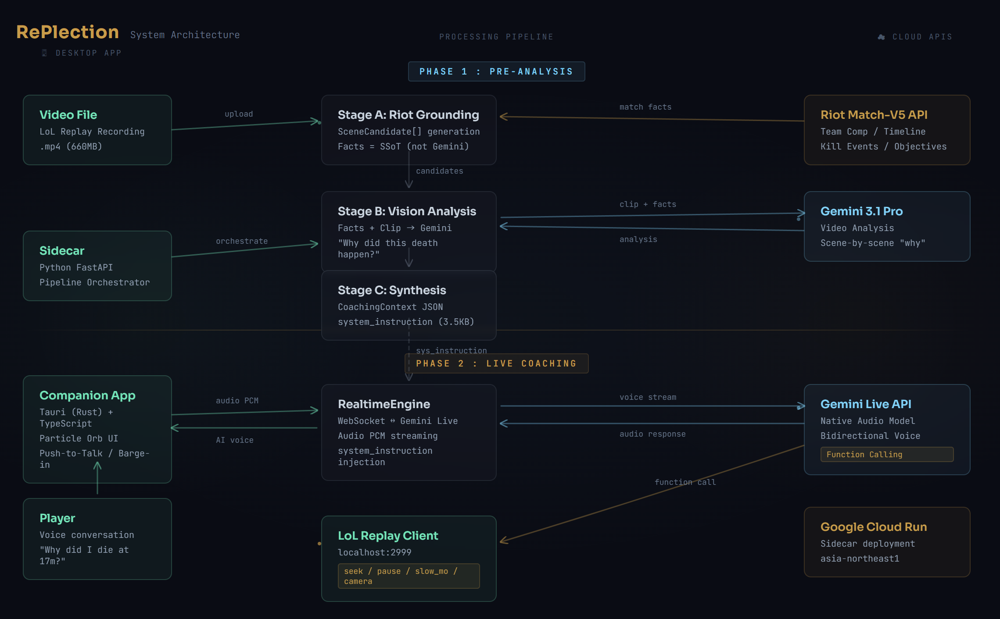

# RePlection



**Get Gold.**

RePlection is an AI friend that watches your League of Legends replays with you. It analyzes your deaths and good plays, then talks you through them in a real-time voice conversation -- while controlling the replay client to show you exactly what happened. Not a coach. A friend. It asks questions instead of lecturing.



## How It Works

RePlection operates in two phases:

### Phase 1: Pre-Analysis

Your replay video (MP4) is uploaded to the Gemini API via the Google GenAI SDK. In parallel, match data is fetched from the Riot Games API (timeline events, player stats, champion info) to ground the analysis in facts. Gemini analyzes each death scene and notable play using both the video and the Riot data, producing a structured coaching context with scene-by-scene breakdowns.

### Phase 2: Live Conversation

The coaching context feeds into a Gemini Live API session for real-time bidirectional voice conversation. The AI controls the LoL Replay Client through Function Calling -- seeking to timestamps, pausing, adjusting playback speed, and locking the camera to your champion. You hold Space to talk, release to listen. Ask "show me that death" and the AI seeks, plays, and explains.

## Architecture



## Tech Stack

| Component              | Technology                                       |
| ---------------------- | ------------------------------------------------ |
| Desktop App            | **Tauri v2** (Rust + TypeScript), Vite     |
| Backend (Sidecar)      | **Python**, FastAPI, uvicorn               |
| Video + Match Analysis | **Gemini 2.5 Flash** via Google GenAI SDK  |
| Voice Conversation     | **Gemini Live API** (native audio preview) |
| Match Data             | **Riot Games API** (Match-V5 + Timeline)   |
| Replay Control         | LoL Replay API (`localhost:2999`)              |
| Cloud Hosting          | **Google Cloud Run**                       |
| Package Manager        | **uv**                                     |

## Getting Started

### Prerequisites

- Python 3.12+
- [uv](https://docs.astral.sh/uv/) (Python package manager)
- Node.js 18+
- Rust toolchain + Cargo (required for [Tauri v2](https://v2.tauri.app/start/prerequisites/))

### Setup

```bash
# Clone the repository
git clone https://github.com/peco-glhf/RePlection.git
cd RePlection

# Configure environment variables
cp .env.example .env
# Edit .env and fill in your API keys (see below)

# Install backend dependencies
uv sync
```

### Environment Variables

Create a `.env` file in the project root with:

```env
GEMINI_API_KEY=your-gemini-api-key
RIOT_API_KEY=your-riot-api-key
RIOT_MATCH_ID=JP1_000000000
RIOT_GAME_NAME=your-summoner-name
RIOT_TAG_LINE=your-tag
```

### Run Locally

```bash
# Terminal 1 -- Start the sidecar backend
uv run python -m sidecar.main

# Terminal 2 -- Start the companion desktop app
cd companion
npm install
npm run tauri dev
```

> **Note:** The LoL Replay Client must be running for replay control to work. Open a replay from the League of Legends client before starting a voice session.

### Usage

1. Select your replay video (.mp4)
2. Click **ANALYZE** -- waits for Riot API + Gemini analysis (~8 min)
3. Click **START** -- begins the voice conversation
4. Hold **Space** to talk, release to let the AI respond
5. Ask about deaths, good plays, or say "show me that scene"

### Cloud Deployment (Google Cloud Run)

```bash
gcloud run deploy replection-sidecar \
  --source . \
  --project YOUR_PROJECT_ID \
  --region asia-northeast1 \
  --allow-unauthenticated \
  --port 8765
```

## Project Structure

```
sidecar/
  main.py              # FastAPI server + session management
  pipeline.py          # Stage A->B->C analysis pipeline
  riot_api.py          # Riot API client + scene candidate generation
  realtime_engine.py   # Gemini Live API voice engine
  replay_controller.py # LoL Replay API control
  models.py            # Data models (CoachingContext, etc.)
companion/
  src/main.ts          # Tauri frontend + particle orb UI
  src/styles.css       # Ethereal Gold orb design
  index.html           # App shell
```

## Disclaimers

RePlection was created under Riot Games' "Legal Jibber Jabber" policy using assets owned by Riot Games. Riot Games does not endorse or sponsor this project.

RePlection isn't endorsed by Riot Games and doesn't reflect the views or opinions of Riot Games or anyone officially involved in producing or managing Riot Games properties. Riot Games, and all associated properties are trademarks or registered trademarks of Riot Games, Inc.

## License

[MIT](LICENSE)

---

Built for the **Gemini Live Agent Challenge** (Live Agents category).
